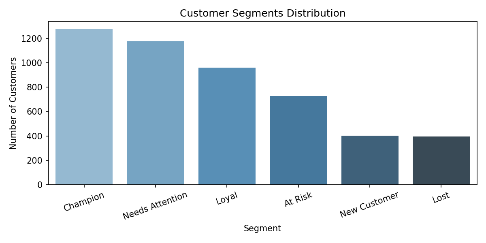
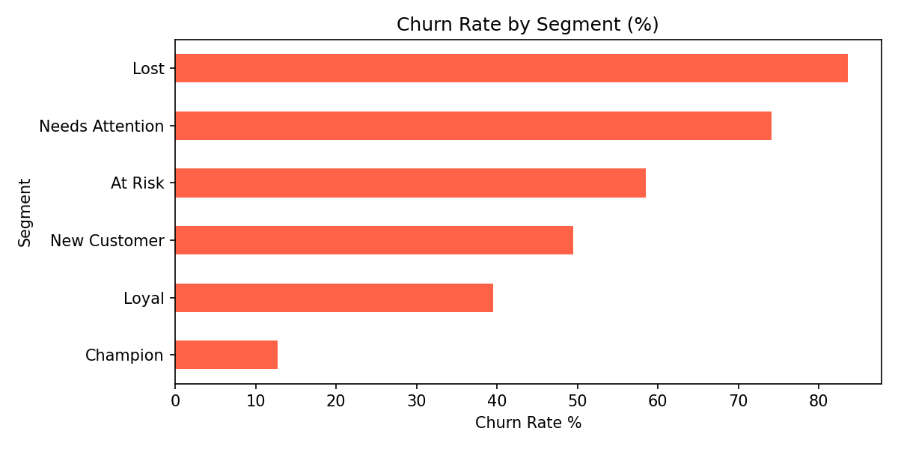

# Customer-Segmentation-Churn-Prediction
Identifies at-risk customers from 500k+ transactions using RFM analysis, XGBoost, and SHAP explainability

## Problem
Every subscription and e-commerce business loses customers silently.
This project identifies which customers are at risk of churning —
before they leave — so the business can act in time.

## Dataset
**Online Retail II** — 500,000+ real transactions from a UK retailer (2009–2011).  
Source: [Kaggle](https://www.kaggle.com/datasets/mashlyn/online-retail-ii-uci)  
*(Download the CSV from Kaggle and place it in the project folder as `Online retail dataset.csv`)*

## What I Built
1. **Data Cleaning** — removed returns, missing IDs, zero-price rows
2. **RFM Analysis** — scored every customer on Recency, Frequency, Monetary value
3. **Customer Segments** — labelled customers as Champion, Loyal, At Risk, Lost etc.
4. **Churn Prediction** — XGBoost model trained on first-half data, tested on second-half
5. **SHAP Explainability** — identified Frequency as the #1 churn driver

## Key Result
- Model accuracy: **67%** on unseen data (no data leakage)
- **Frequency** is the strongest predictor of churn — low-frequency buyers churn most
- Recommendation: Target customers with ≤2 orders with a second-purchase discount campaign

## How to Run
```bash
pip install -r requirements.txt
jupyter notebook load_and_clean_data.ipynb
```

## Tools Used
Python, Pandas, Scikit-learn, XGBoost, SHAP, Matplotlib, Jupyter

## Results




